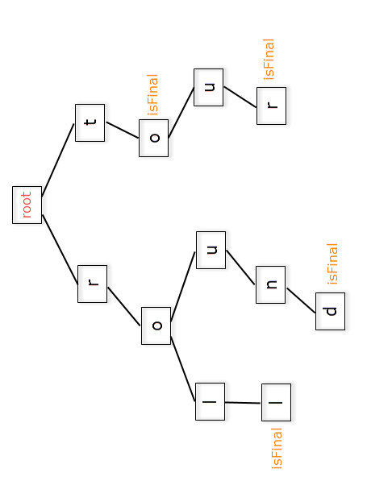

### Part 1 — Overview .

Hey there! This is a series of blog posts which will cover in detail the most essential topics necessary for placements. Only those topics and problems will be discussed which have been asked again and again in the interviews and coding rounds of some of the best tech companies such as Google, Amazon, GS, Microsoft, Flipkart ..

This Blog Series will enable you to crack the placement season with ease. Apart from discussing each topic we will also guide you through some of the great resources & tutorials available on the internet for each and every topic.

We have divided these blog into 3 chapters :

 1) The Algo-DS Chapter

In this Chapter we will take a topic, understand its basics and the dive into some of the must do problems on the topic.

### -The Beginner Topics

*Linked List* — Linked List and Tree are the “Go To” topics for the interview round for every company. This topic helps the interviewer judge your coding abilities .They generally assign you an easy logical question and need a perfect bug free code from you. If you are to appear in an interview chances are you will definitely get one problem from this section.

*Stack & Queue* — These data Structures are easy for understand and implement. The tricky part is the problems where these are applied.The problems point no clue towards these data structures. Without practicing this DS you just can’t solve these subtle problems.

*Binary Search* — Binary Search can solve a huge catalog of problems. Interviewers love when you provide an out the box binary search solution to their seemingly difficult problems. This topic can be your secret weapon.

*Recursion* — Recursion is the backbone for the most dreaded Algorithmic Topic “DP”. If you can master recursion then you are all set to master DP.

*Sorting* — Well do i need to write anything about sorting, chances are if you are here, you probably know sorting. The interviewers love to see us perform sort on “Custom Datatypes”. Thus we will cover these and the basics of Sorting.

*Greedy Algorithms* — Well Greedy is the most frequently asked topic in coding rounds. The key to solving greedy problems is attack every problem as if it is greedy, then before writing code test your logic thoroughly through dry run.These are easiest to implement. If you solve greedy problems fast, it leaves you extra time for other problems

*** 

### The Crucial topics

<!--  -->

Once you have aced through the beginner problems, the interviewer is already pleased. Just solve the crucial problem and you are all set to get an offer. Lets Begin!

*DP* — This is most frequently asked topic in the interviews. Rarely you walk out of an interview with an offer without solving one of these. Practicing DP is a must for anyone who is aiming to get into a top tier company.

*Hashing & Two pointers* — The de facto solution to most of the linear time problems.Two pointers provide constant space solution and are generally the most optimal solution to linear time problems.

*Tries* — The newest addition to the crucial topics. Tries have become the latest trending topic in the interviews.This topic helps interviewer test both logical and coding skills of the candidate

*Graph Algorithms* — From shortest path in a graph to topological sorting. Graph Algorithms cover a large variety of problems. You need to acquaint yourself with these problems if you hope to solve these in a interview.

*Binary Operators* — In this we will tackle all the nits and grits of XOR and AND operators. These are the questions where you have to know the solutions. They are asked and you have to solve them.

*BST & Heaps* — A crucial and easy to master topics with a huge repository of question.You need to practice just a few questions and then you can easily tackle any variation on them.

*Math Problems* — Modular Arithmetic and Sieve are two of the most common topics in coding rounds and are must know for anyone who is taking coding round seriously.

*** 

### -The Pro Topics

Well you have solved all the problems. The interviewer now wants to test your limit.Can you go the extra mile? Now comes the PRO question, Solve it and leave the interviewer in awe..

 > Warning: Practice these topics only when you have covered everything else.

*Segment tree* — Segment tree will make your life a lot easier if you are able to master it. This data structure can solve a whole lot of problems. If are able to master it, I am assured you are on your way to a top tier company :)

*Fenwick Tree* — This topic generally comes handy in coding round questions. Some of the hard coding questions can be solved in 20 lines of code with this data structure.

*KMP* — String Matching is one of those topics where if you don’t know the algorithm you will be blank faced in the interview,but if you know it then you can solve it with ease. This topic is less about practicing and more about understanding and being able to explain the approach in the interview.

*DP* — There is no escaping DP. You will be asked DP questions again and again, probably in every round. Thus if want to master any one topic thoroughly then it has to be DP.

*Red Black Tree*- This again is one of those theoretical DS topics, where you need to explain the concept and code the basic functions neatly .

Upcoming in next Blog- The Overview for other chapters namely OOPS, OS and System Design Chapters
